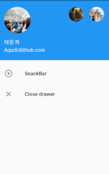
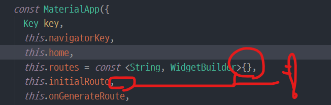

# flutterexamples

Examples for flutter apps.

## Drawer
### main.dart

1. Drawer 구성 - 헤더, 아이템  
    
2. GlobalKey 로 Scaffold 제어
    ```dart
    final GlobalKey<ScaffoldState> _scaffoldKey = new GlobalKey();
    ...
    RaisedButton(
      child: Text('Tap to open drawer'),
      onPressed: () => _scaffoldKey.currentState.openDrawer(),
    ) 
    ```

## Snack bar
### snack_bar_page.dart
Document link : [Display a snackbar](https://flutter.dev/docs/cookbook/design/snackbars)

1.  Scaffold.of(context) method  
    "*현재 주어진 Context 에서 가장 가까운 Scaffold 를 찾아 반환해라*"

    Scaffold 외에 여러가지 Widget 에 적용 가능하다.

    + **문제점**  
      아래와 같은
      상황이면 부모의 Context 를 가지고 상위 Widget 들 중에 Scaffold 를 탐색하게 되는데 내가 원하는 Scaffold 는 아래의 _SnackBarPageState 클래스 안에 존재한다.
      ```dart
      class _SnackBarPageState extends State<SnackBarPage> {
        @override
        Widget build(BuildContext context) {
          return Scaffold(
              appBar: AppBar(
                title: Text('Snack Bar Test'),
                centerTitle: true,
                backgroundColor: Colors.red,
              ),
              body: Center(
                child: FlatButton(
                  child: Text('Show me',
                      style: TextStyle(
                        color: Colors.white,
                      )),
                  color: Colors.red,
                  onPressed: () {
                    Scaffold.of(context).showSnackBar(SnackBar(
                      content: Text('This is SnackBar!!'),
                    ));
                  },
                ),
              )
          );
        }
      }
      ```
    + **해결법**
      Scaffold 를 Builder 위젯의 build 함수에 넣어줌으로서 부모에서 받은 context 외에 Builder 
      위젯부터 시작하는 새로운 context childContext 를 만들어 사용할 수 있다.

      ```dart
      body: Builder(builder: (BuildContext childContext) {
        return Center(
          child: FlatButton(
            child: Text('Show me',
                style: TextStyle(
                  color: Colors.white,
                )),
            color: Colors.red,
            onPressed: () {
              Scaffold.of(childContext).showSnackBar(SnackBar(
                content: Text('This is SnackBar!!'),
              ));
            },
          ),
        );
      }));
      ```
    + **해결법2**  
    커스텀 Widget 을 만들어준다. 
    이렇게 할 시 Widget 의 build 메소드를 오버라이드할 때 Context 를 새롭게 
    만드므로 위의 Builder 위젯을 사용한 것과 동일한 효과가 난다.
      ```dart
      class MySnackBar extends StatelessWidget {
        @override
        Widget build(BuildContext context) {
          return Center(
            child: RaisedButton(
              child: Text('Show me'),
              onPressed: () {
                Scaffold.of(context).showSnackBar(SnackBar(
                  content: Text(
                    'Snack Bar with custom widget!!',
                    textAlign: TextAlign.center,
                    style: TextStyle(color: Colors.white),
                  ),
                  backgroundColor: Colors.teal,
                  duration: Duration(microseconds: 1000),
                ));
              },
            ),
          );
        }
      }
      ```
    + **해결법3**
    Flutter Toast Library 사용 [링크](https://pub.dev/packages/fluttertoast)

## Navigator
### Navigation folder
1. push, pop 메소드
    push 메소드 (화면 전환)
    ```dart
    RaisedButton(
      child: Text('Go to SecondPage'),
      color: Colors.blue,
      onPressed: () => Navigator.push(
          context,
          MaterialPageRoute(builder: (context) => SecondPage())),
    ),
    ```
    pop 메소드
    ```dart
    Navigator.pop(context);
    ```  
    AppBar 가 있을 경우 뒤로가기 버튼이 생긴다.

2. pushNamed 메소드
    MaterialApp() 의 home 대신에 initialRoute 를 넣어주고
    사용할 Route 들을 routes 에 Map 형식으로 지정해주면 사용이 가능하다.
    장고의 Urls.py 와 비슷한 느낌을 준다.
    

    ```dart
    class MyApp extends StatelessWidget {
      // This widget is the root of your application.
      @override
      Widget build(BuildContext context) {
          return MaterialApp(
            title: 'Flutter Demo',
            theme: ThemeData(
              primarySwatch: Colors.blue,
            ),
          
            // Navitaion - pushNamed
            initialRoute: '/',
            routes: {
              '/' : (context) => HomePage(),
              '/b' : (context) => PushNamedB(),
              '/c' : (context) => PushNamedC(),
            },
            //home: HomePage(),
          );
      }
    }
    ```
    ```dart
      RaisedButton(
        color: Colors.green,
        child: Text('Go to PushNamedB'),
        onPressed: () {
          Navigator.pushNamed(context, '/b');
        },
      ),
      RaisedButton(
        color: Colors.green,
        child: Text('Go to PushNamedC'),
        onPressed: () {
          Navigator.pushNamed(context, '/c');
        },
      )
    ```
3. pushNamed Arguments 넘겨주기
    + Route 부분은 방법1, 방법2 동일
      ``` dart
        Navigator.pushNamed(
          context, PassArgumentsPage.routeName,
          arguments: Arguments('title', 'message')
      ```
    + 방법1: Extract Arguments  
      main.dart의 MaterialApp(
        routes: 내용을 수정해준다.
      )
      ``` dart
      routes: {
        ...
        // Navigator.pushNamed
        ExtractArgumentsPage.routeName: (context) => ExtractArgumentsPage()
      },   
      ```
      
      아래 메소드를 이용하여 context에서 arguments 를 추출한다. ModalRoute.of(contex).settings.arguments
      ```dart
      class ExtractArgumentsPage extends StatelessWidget {
        static const routeName = '/extractArguments';

        @override
        Widget build(BuildContext context) {
          // context 에서 arguments 추출
          final Arguments args = ModalRoute.of(context).settings.arguments;

          return Scaffold(
            appBar: AppBar(
              title: Text(args.title),
            ),
            body: Center(
              child: Text(args.message),
            ),
          );
        }
      }
      ```
    + 방법2: Pass Arguments
        main.dart의 MaterialApp(
          onGenerateRoute: 에 route 할 때 취할 동작을 적어준다.
        )
        ``` dart
        onGenerateRoute: (settings) {
        /*
        // settings type : RouteSettings
        
        const RouteSettings({
          String name, // 라우터 이름
          bool isInitialRoute: false, // 초기 라우터여부
          Object arguments // 인자들
        })
        */
        if(settings.name == PassArgumentsPage.routeName) {
          final Arguments args = settings.arguments;

          return MaterialPageRoute(
            builder: (context) {
              return PassArgumentsPage(
                title: args.title,
                message: args.message,
              );
            }
          );
        }
      },  
        ```
        생성자로 arguments 를 받아준다.
        ```dart
        class PassArgumentsPage extends StatelessWidget {
          static const routeName = '/passArguments';

          final String title;
          final String message;

          // 인자로 arguments 넘겨받기
          const PassArgumentsPage({
            Key key,
            @required this.title,
            @required this.message,
          }) : super(key: key);

          @override
          Widget build(BuildContext context) {
            return Scaffold(
              appBar: AppBar(
                title: Text(title),
              ),
              body: Center(
                child: Text(message),
              ),
            );
          }
        }
        ```
